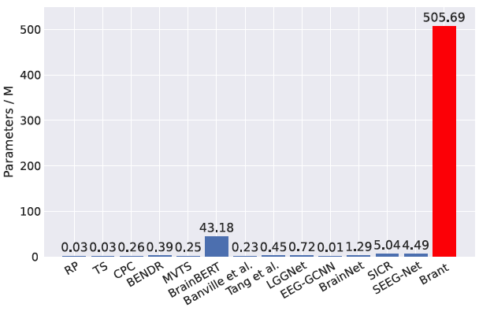
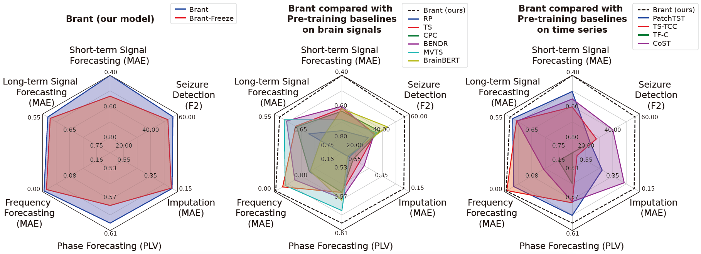

# Brant: Foundation Model for Intracranial Neural Signal

Brant is a foundation model in the field of intracranial recordings, which learns powerful representations of intracranial neural signals.


### News

- [2025.05.17] We have uploaded the model code on [HuggingFace](https://huggingface.co/Daoze/Brant). Now anyone can access the finetuning code without sending email to the authors!

- [2024.05.08] Due to the request from our collaboration partner, we are temporarily unable to directly share our code publicly. If you require access, please contact zhangdz@zju.edu.cn.


### Abstract

Brant is a foundation model for modeling intracranial recordings, which learns powerful representations of intracranial neural signals by pre-training, as a large-scale, off-the-shelf model for medicine. Brant is the largest model in the field of brain signals and is pre-trained on a large corpus of intracranial data. The design of Brant is to capture long-term temporal dependency and spatial correlation from neural signals, combining the information in both time and frequency domains.


### Model Scale
Brant is the largest model on brain signals and pre-trained on a large intracranial dataset collected by us. As shown in the figure below, Brant contains over 500M parameters, far more than other existing works on brain signals.




### Performance
The figure below summarizes the results of all the downstream tasks, including neural signal forecasting, frequency-phase forecasting, imputation and seizure detection. As a foundation model for intracranial recordings, compared with other baselines, Brant achieves consistent SOTA performance on a variety of tasks w.r.t. several medical scenarios, showing the great potential in neural recordings modeling.




### Future Works
In the future, by scaling up our dataset, the scale of our model can be further expanded to capture higher-level semantic information from neural data, revealing more complicated brain activities and dynamics, to provide assistance for more healthcare applications.


### BibTeX

```
@inproceedings{zhang2023brant,
  title={Brant: Foundation Model for Intracranial Neural Signal},
  author={Zhang, Daoze and Yuan, Zhizhang and Yang, Yang and Chen, Junru and Wang, Jingjing and Li, Yafeng},
  booktitle={Thirty-seventh Conference on Neural Information Processing Systems},
  year={2023}
}
```


### Ethics Statement
The data collection and experiments conducted in our work have been approved by the Institutional Review Board (IRB) and passed ethical review. All participants have signed informed consent forms.

